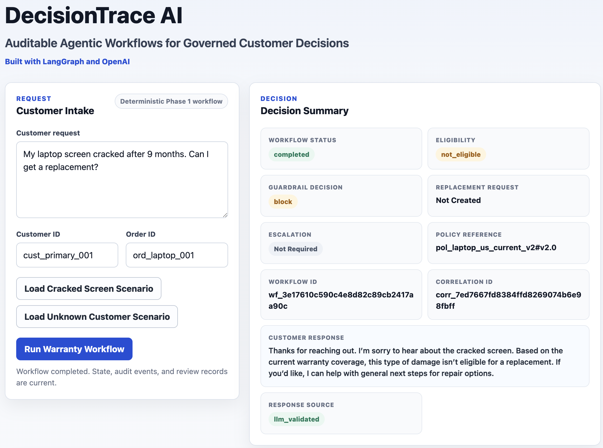
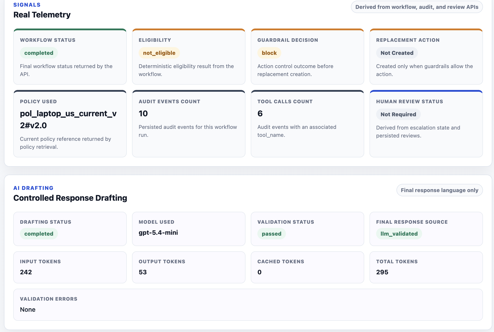
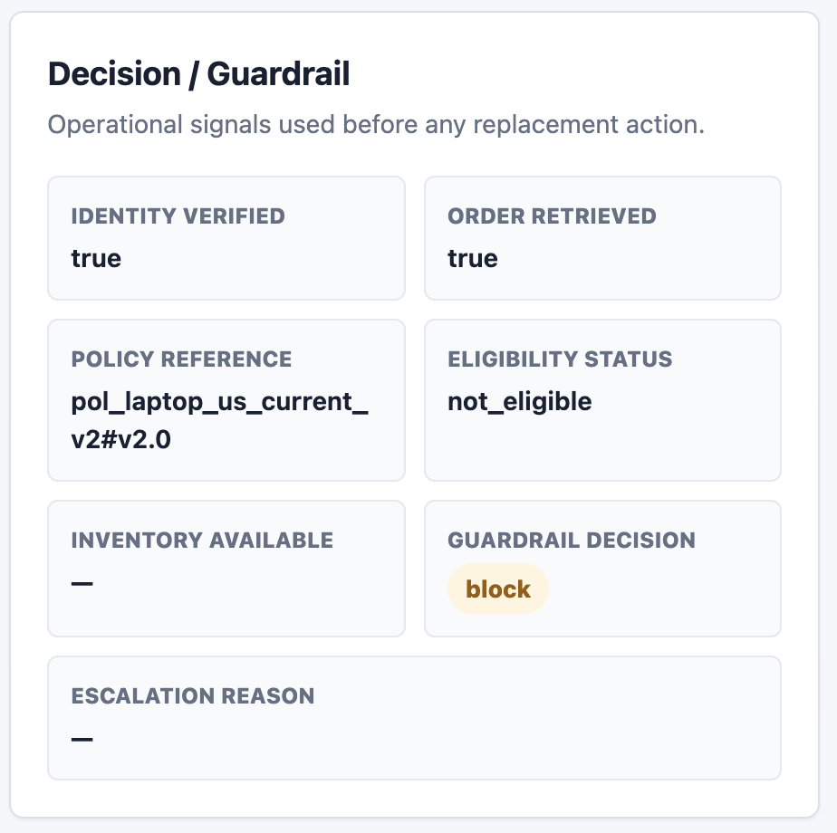
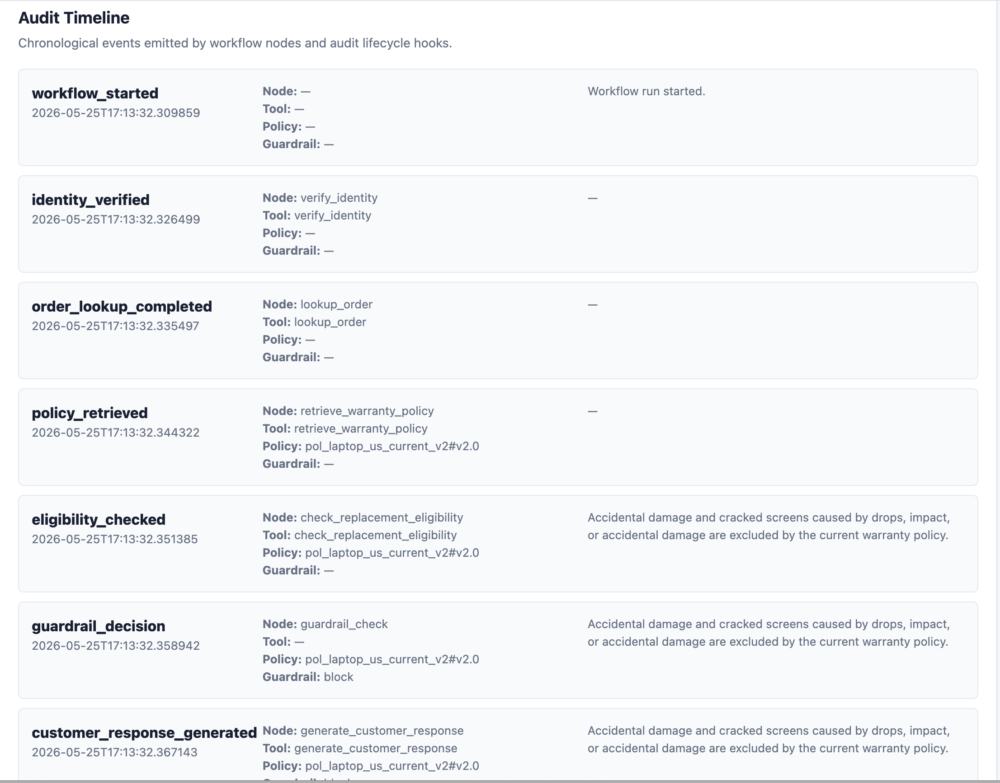
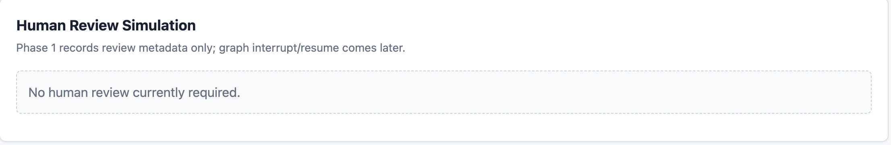

# DecisionTrace AI

**Auditable Agentic Workflows for Governed Customer Decisions**

> **Validate the control model before connecting production systems.**
>
> DecisionTrace AI lets teams prototype governed AI workflows with synthetic data, align Audit/Risk/Security stakeholders early, and connect to enterprise API adapters when ready — without redesigning the workflow architecture.

## Executive Overview

DecisionTrace AI is a working reference platform and prototype accelerator for enterprises exploring AI-assisted decision workflows. It helps teams model workflow steps, decision points, guardrails, audit events, human review paths, LLM response boundaries, and cost drivers before exposing sensitive production systems.

The current implementation is a warranty replacement reference workflow, but the architecture is broader than warranty support. The same pattern can apply to regulated and customer-impacting workflows such as credit approval, insurance claims, refunds, compliance exceptions, and service escalations.

## Prototype Accelerator Value

A client does not need to connect sensitive production systems on day one. The current reference workflow uses synthetic data and controlled tool simulations so cross-functional stakeholders can validate the control model quickly and cost-effectively. Once the control model is validated, tool implementations can be connected to enterprise API adapters while preserving the same LangGraph workflow, state model, guardrails, audit trail, LLM response drafting boundary, and UI telemetry.

## Business Problem

Customer-impacting decision workflows are high-trust processes. A correct warranty replacement decision, for example, requires customer verification, order lookup, warranty policy review, eligibility decisioning, inventory checks, controlled action execution, customer-safe communication, and a durable audit trail. A weak implementation can approve the wrong replacement, cite stale policy, expose unnecessary data, or leave the business unable to reconstruct why a decision was made.

## Current Reference Workflow

The first implemented workflow is warranty replacement. Warranty replacement is useful as a reference workflow because it demonstrates the same control challenges found in higher-stakes workflows:

- Policy grounding
- Eligibility checks
- Guardrail-controlled actions
- Human review
- Audit replay
- Customer-safe communication
- LLM boundary control

## Future Workflow Domains

- Credit approval
- Loan document review
- Insurance claims
- Refund governance
- Subscription cancellation
- Benefit eligibility
- Compliance exception review
- Customer escalation routing

## What the Demo Shows

Primary scenario:

> My laptop screen cracked after 9 months. Can I get a replacement?

Expected behavior:

- Customer identity is verified.
- The order is retrieved and confirmed as delivered.
- The current customer-facing laptop warranty policy is retrieved.
- The cracked screen is identified as excluded accidental damage under the current policy.
- Replacement request creation is blocked by guardrail logic.
- A customer-safe response is generated.
- The workflow state and audit trail are persisted.

## Architecture Summary

```text
Customer UI
→ FastAPI API layer
→ LangGraph workflow
→ governed tool layer
→ deterministic guardrails
→ controlled OpenAI response drafting
→ SQLAlchemy persistence
→ Postgres audit trail
```

FastAPI serves both the API and the static frontend. LangGraph orchestrates the warranty workflow as a stateful graph. Controlled tool simulations perform identity verification, order lookup, warranty policy retrieval, eligibility checks, inventory checks, replacement creation, escalation, and deterministic response generation in Phase 1. OpenAI can draft final customer-facing response language from minimized approved workflow state when configured. SQLAlchemy persists workflow runs, audit events, and human review records.

Architecture diagrams: [docs/diagrams.md](docs/diagrams.md)

Demo walkthrough script: [docs/demo-script.md](docs/demo-script.md)

Executive summary: [docs/executive-summary.md](docs/executive-summary.md)

Cost model v1: [docs/cost-model.md](docs/cost-model.md)

Audit replay example: [docs/audit-replay-example.md](docs/audit-replay-example.md)

Agentforce mapping: [docs/agentforce-mapping.md](docs/agentforce-mapping.md)

Prompt governance checklist: [docs/prompt-governance-checklist.md](docs/prompt-governance-checklist.md)

Safe iteration loop: [docs/safe-iteration-loop.md](docs/safe-iteration-loop.md)

Phase 1 release notes: [docs/phase-1-release-notes.md](docs/phase-1-release-notes.md)

Phase 1 release checklist: [docs/phase-1-release-checklist.md](docs/phase-1-release-checklist.md)

Known limitations and roadmap: [docs/roadmap.md](docs/roadmap.md)

DecisionTrace AI’s roadmap includes a stateful intake router, prompt governance, and an observability-to-evaluation loop so production failures can become regression tests.

Phase 2 branch note: `phase-2/intake-router` introduces a stateful natural-language intake router that classifies freeform customer messages, extracts structured facts, identifies missing or invalid fields, supports a lightweight multi-turn clarification session, and routes ready warranty replacement requests into the existing controlled workflow. Conversation context is used only to collect required facts; LangGraph still governs eligibility, guardrails, escalation, and action execution.

## Phase 1 Capabilities

- FastAPI backend
- Polished browser-based workflow console
- LangGraph workflow
- Controlled tool simulations
- Deterministic eligibility and guardrail logic
- Controlled LLM response drafting when configured
- Persisted workflow runs
- Persisted audit events
- Persisted human review records
- Railway deployment support
- Local SQLite fallback
- Railway Postgres compatibility

## Enterprise AI Architecture Concepts Demonstrated

- Agentic workflow orchestration
- State-based control
- Tool/action design
- RAG-style policy grounding using controlled policy retrieval
- Deterministic guardrails
- Human handoff simulation
- Auditability and replay
- Data minimization
- Separation of reasoning, decisioning, and action execution
- Cost-aware architecture
- Agentforce-style architecture mapping

## Technology Stack

- Python
- FastAPI
- LangGraph
- OpenAI
- SQLAlchemy
- SQLite local fallback
- Railway Postgres
- Vanilla HTML/CSS/JavaScript frontend
- Railway
- GitHub

## Live Demo

Live demo: `<add Railway public URL here>`

The Phase 1 UI is a polished enterprise workflow console built with vanilla HTML, CSS, and JavaScript. It displays real workflow state, persisted audit events, derived tool-call counts, human review status, and audit replay details from the backend APIs without adding frontend framework complexity.

Controlled LLM response drafting is supported when `OPENAI_API_KEY` and `OPENAI_MODEL` are configured. Without those variables, the app uses deterministic response generation and marks LLM drafting as `not_configured`.

## Telemetry Integrity

The demo uses synthetic business data, but active telemetry is real. Workflow state, audit events, tool-call counts, human review records, OpenAI model metadata, and token usage are generated by actual application execution and backend API responses. Planned telemetry is clearly labeled as future work.

## Local Setup

```bash
cd backend
python -m venv .venv
source .venv/bin/activate
pip install -r requirements.txt
uvicorn app.main:app --reload
```

Open:

```text
http://127.0.0.1:8000
```

The local default database is SQLite:

```env
DATABASE_URL=sqlite:///./warrantywise.db
```

Phase 1 creates tables automatically at startup using SQLAlchemy `Base.metadata.create_all()`. Alembic migrations are a future enhancement.

## API Usage

Health check:

```bash
curl http://127.0.0.1:8000/health
```

Start workflow:

```bash
curl -X POST http://127.0.0.1:8000/api/workflows/start \
  -H "Content-Type: application/json" \
  -d '{
    "customer_request": "My laptop screen cracked after 9 months. Can I get a replacement?",
    "customer_id": "cust_primary_001",
    "order_id": "ord_laptop_001"
  }'
```

Retrieve workflow:

```bash
curl http://127.0.0.1:8000/api/workflows/{workflow_id}
```

Retrieve audit timeline:

```bash
curl http://127.0.0.1:8000/api/workflows/{workflow_id}/audit
```

Submit simulated human review:

```bash
curl -X POST http://127.0.0.1:8000/api/workflows/{workflow_id}/human-review \
  -H "Content-Type: application/json" \
  -d '{
    "decision": "request_more_info",
    "reviewer_id": "reviewer_001",
    "reason": "Need verified customer identity before proceeding."
  }'
```

Retrieve human review records:

```bash
curl http://127.0.0.1:8000/api/workflows/{workflow_id}/human-reviews
```

## Auditability and Governance

DecisionTrace AI persists workflow state, audit events, and human review decisions for the warranty replacement reference workflow. The audit trail helps reconstruct:

- Customer request
- Identity verification
- Order lookup
- Policy retrieval
- Eligibility decision
- Guardrail decision
- Replacement creation or block
- Escalation and human review
- Customer response

Audit payloads are intentionally minimal. The workflow avoids logging full customer profiles, payment data, or unnecessary sensitive fields. This demonstrates enterprise-grade data minimization alongside traceability.

## Cost-Aware Architecture

The current workflow keeps eligibility, guardrail, and action decisions deterministic. Optional LLM response drafting can add provider-reported token fields when configured. Future cost modeling will include:

- Token consumption
- Tool/API calls
- Retrieved context cost
- Audit/observability overhead
- Human escalation cost
- Prompt caching
- Semantic caching
- Model routing
- State/history summarization
- Execution hard caps

## Agentforce Mapping Preview

- DecisionTrace AI workflow → Agentforce agent/subagent
- Tools → Agentforce actions
- Warranty policy retrieval → grounding
- Guardrails → Flow/Apex/policy controls
- Human review → case/approval/queue
- Audit events → execution/audit trail

## Current Limitations

- Synthetic data only
- No real Salesforce integration
- No real customer authentication
- No real shipping/fulfillment integration
- No LLM intake classifier or multi-turn conversation yet
- No real Ragas/Langfuse/LangSmith yet
- No real MCP/A2A yet
- Human review is simulated, not a true LangGraph interrupt/resume yet

## Roadmap

- Controlled workflow console enhancements
- Expanded controlled LLM response drafting
- Architecture diagrams
- Screenshots
- Cost model v1
- Audit replay example
- Agentforce mapping
- Ragas evaluation
- Langfuse/LangSmith observability
- CrewAI review crew
- MCP-style tool abstraction
- A2A fulfillment delegation
- LangGraph interrupts for real HITL pause/resume

## Railway Deployment

Railway deployment is designed as one FastAPI app service plus one Railway Postgres service.

1. Create a new Railway project.
2. Add a Postgres service.
3. Add a GitHub repo service connected to this repository.
4. Make sure the app service has `DATABASE_URL` from the Railway Postgres service.
5. Railway provides the `PORT` environment variable automatically.
6. The Docker start command runs Uvicorn on `0.0.0.0:$PORT`.
7. Generate a public domain from the Railway Networking settings.

SQLite is for local development only. Railway should use Postgres through `DATABASE_URL`.

## Repository Structure

```text
backend/app              FastAPI application, database setup, and app entry point
backend/app/workflow     LangGraph state, nodes, graph, and workflow persistence
backend/app/tools        Controlled tool simulations and synthetic domain data
backend/app/audit        Audit event logging, audit storage, and human review storage
backend/app/models       Pydantic API/domain models and SQLAlchemy ORM models
frontend                 Static HTML/CSS/JavaScript demo UI served by FastAPI
docs                     Architecture, audit, guardrail, cost, and mapping notes
backend/tests            Unit and API tests for workflow, tools, persistence, and serving
```

## Phase 1 Demo Screenshots

These screenshots show the baseline deployed Phase 1 workflow before the polished workflow console pass. The current UI preserves the same LangGraph workflow, guardrail decisioning, audit timeline, and human review simulation while presenting them in a more operations-focused dashboard.

### Customer Request Screen



### Cracked-Screen Workflow Result



### Guardrail Block Decision



### Audit Timeline



### Human Review Panel


