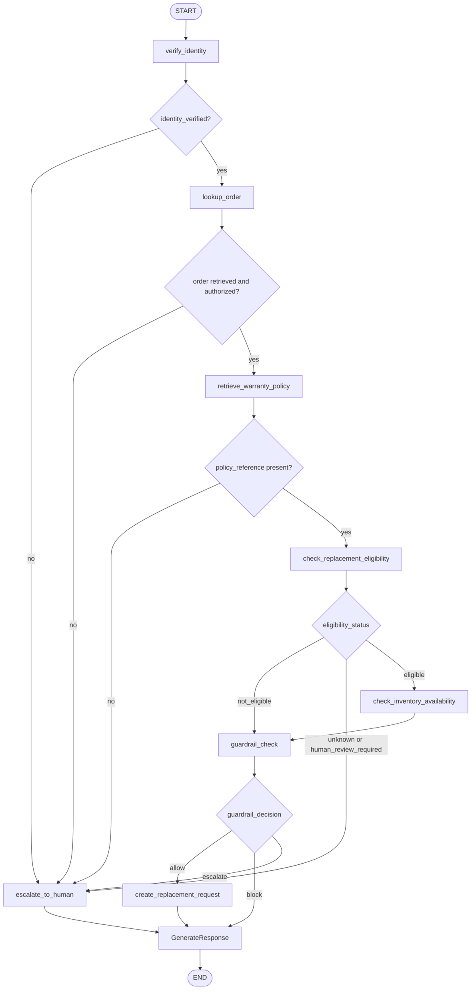

# Architecture

## Phase 1 LangGraph Workflow

Phase 1 uses LangGraph to model the warranty replacement flow as an explicit local state machine. The graph gives the capstone a clear orchestration layer for sequencing governed tools, branching on deterministic state, and preserving decision fields that can later become audit records.

No real LLM calls, external integrations, interrupts, or deployment concerns are included in this phase. The workflow is deterministic and uses the mocked tools in `backend/app/tools/warranty_tools.py`.

## Workflow Sequence

The local workflow follows this sequence:

1. Verify the customer identity.
2. Look up the order and confirm the order belongs to the customer.
3. Retrieve the current US laptop warranty policy.
4. Check replacement eligibility under the current policy.
5. If eligible, check inventory availability.
6. Run the replacement creation guardrail.
7. Create a replacement request only when all guardrail conditions pass.
8. Escalate to a human when required.
9. Generate a safe customer response.

For the primary scenario, “My laptop screen cracked after 9 months. Can I get a replacement?”, the workflow determines that accidental damage and cracked screens are excluded by the current policy. It does not create a replacement request.

## Phase 1 Tooling

All tools are deterministic mock functions. They return simple dictionaries, include `result_status`, and apply local guardrails before returning action-oriented results. The workflow does not use the deprecated warranty policy in the happy path; it retrieves only the current policy for decisioning.

Future enhancements include LangGraph interrupts, persistence, observability, Ragas evaluation, CrewAI collaboration patterns, MCP tool integration, and A2A interoperability. Those capabilities are intentionally deferred so the first workflow remains easy to test and explain.

## Phase 1 Auditability

The workflow records audit events for meaningful steps: workflow start, identity verification, order lookup, policy retrieval, eligibility checks, inventory checks, guardrail decisions, replacement request creation, human escalation, customer response generation, workflow completion, and workflow failure.

Audit logging is persisted through SQLAlchemy in the `audit_events` table. This keeps Phase 1 deterministic and testable while preserving the shape of the audit trail that will later run on Postgres for durable deployment.

## Phase 1 API Layer

FastAPI exposes the local workflow for frontend or external callers. The API does not add deployment configuration, real LLM calls, or LangGraph interrupt/resume behavior.

Endpoints:

- `GET /health`: health check.
- `POST /api/workflows/start`: starts a warranty workflow and stores the final state.
- `GET /api/workflows/{workflow_id}`: retrieves the stored workflow state.
- `GET /api/workflows/{workflow_id}/audit`: retrieves the audit timeline for a stored workflow.
- `POST /api/workflows/{workflow_id}/human-review`: simulates human review metadata for escalated workflows.
- `GET /api/workflows/{workflow_id}/human-reviews`: retrieves persisted human review records.

Workflow results are stored through `backend/app/workflow/store.py`.

## Phase 1 Frontend Demo

The Phase 1 frontend is a lightweight static UI served directly by FastAPI from the `frontend/` directory. It uses vanilla HTML, CSS, and JavaScript, with no React, Vite, Node, npm, or frontend build tooling.

The UI visualizes the local LangGraph workflow by letting a user submit a customer request, view the final decision state, inspect the guardrail result, read the audit timeline, and simulate human review when an escalation exists.

React and Vite can be added later if the UI grows into a richer application. They are intentionally skipped in Phase 1 to reduce tooling complexity and keep the capstone demo focused on backend workflow behavior, governance, and auditability.

## Phase 1 Persistence Layer

Phase 1 uses synchronous SQLAlchemy with a SQLite local fallback. The default `DATABASE_URL` is `sqlite:///./warrantywise.db`, so local development and tests do not require Postgres.

The persistence tables are:

- `workflow_runs`: stores workflow IDs, correlation IDs, customer/order references, workflow status, and final workflow state as JSON.
- `audit_events`: stores reconstructable workflow audit events with safe input/output summaries.
- `human_reviews`: stores simulated human review decisions for escalated workflows.

The design is compatible with Railway Postgres later by setting `DATABASE_URL` to a `postgresql://...` connection string. Phase 1 uses `Base.metadata.create_all()` at startup instead of Alembic migrations; migrations are a future enhancement.

Persistence improves auditability because workflow decisions, guardrail outcomes, and human review records survive API calls and process restarts. It gives the capstone a durable trail for enterprise review without changing the deterministic workflow behavior.
