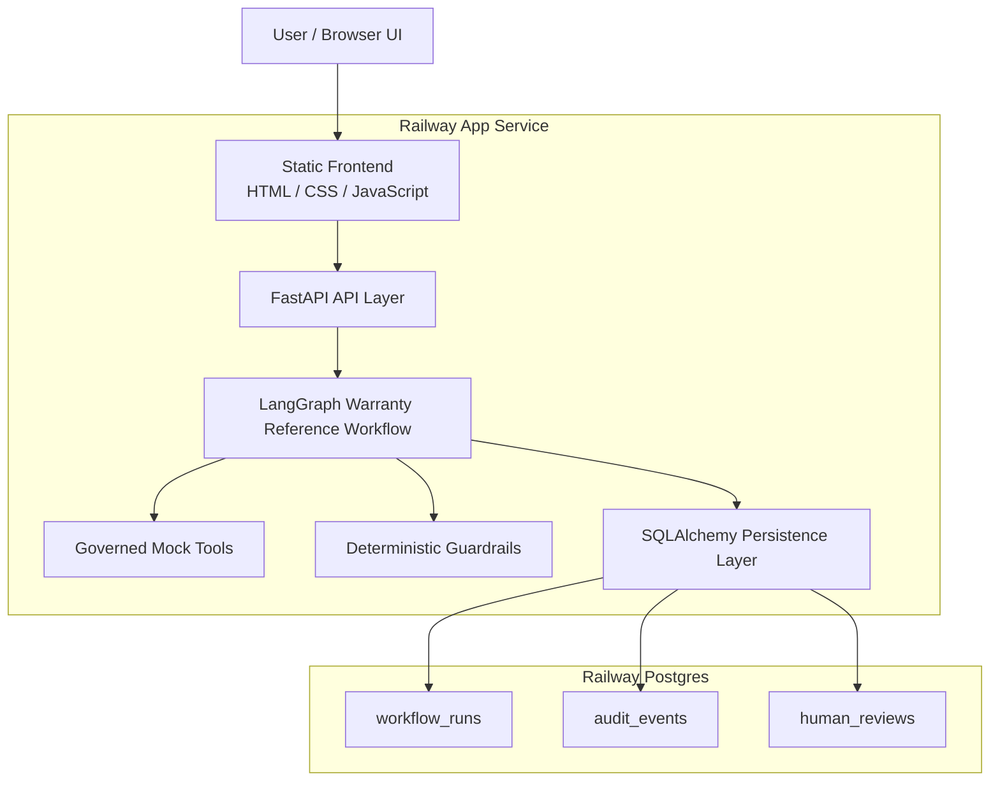
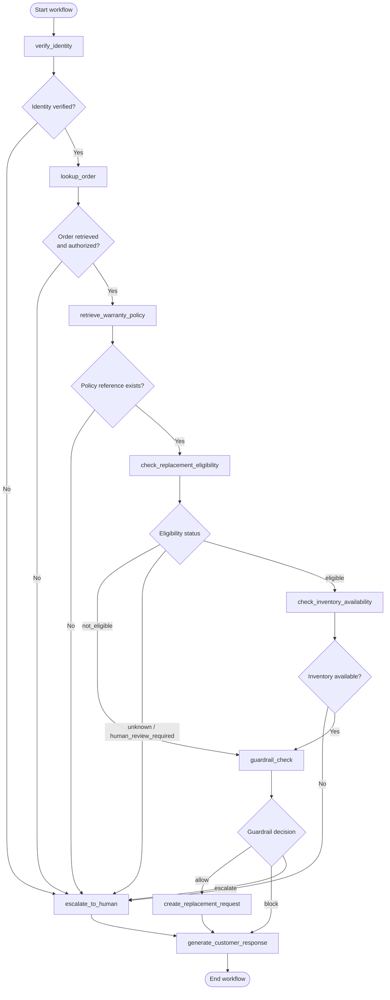
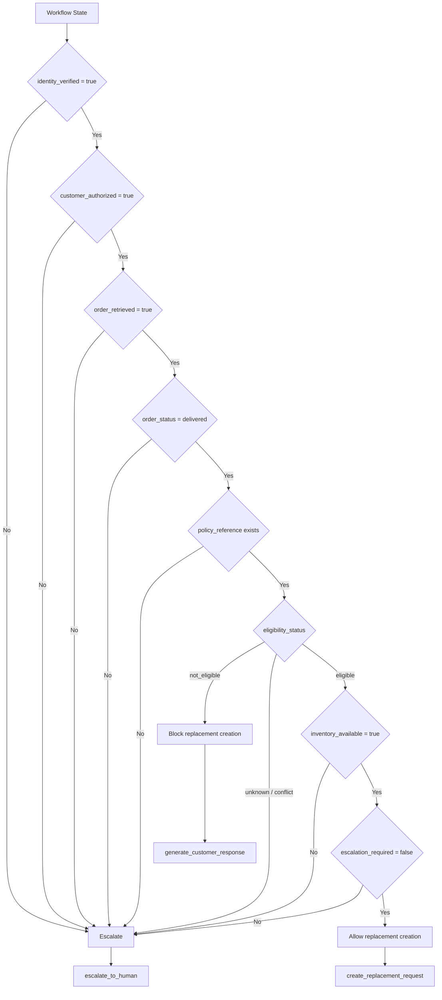
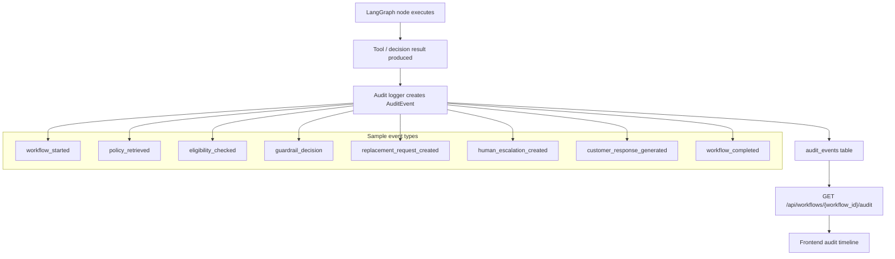
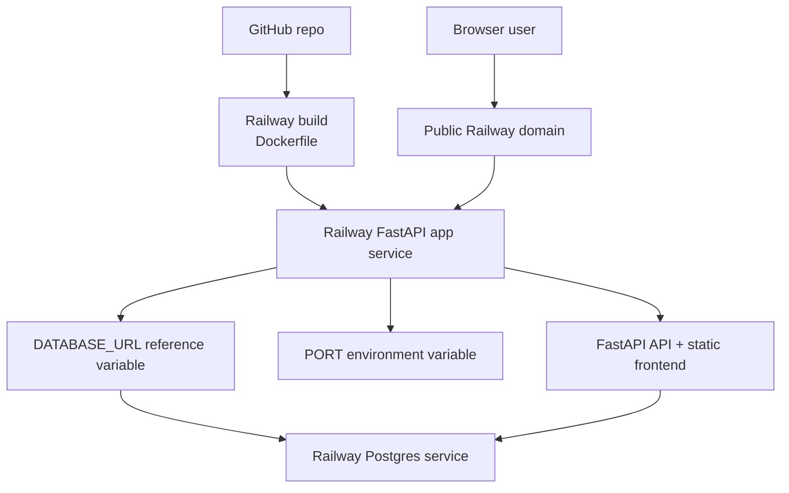
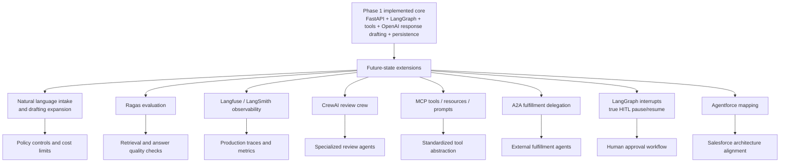

# DecisionTrace AI Architecture Diagrams

These diagrams show the Phase 1 architecture and planned future-state extensions for DecisionTrace AI, an enterprise-grade agentic decision workflow platform. The diagrams currently show the warranty replacement reference workflow implemented in Phase 1. Phase 1 is deterministic and production-aware: FastAPI serves the frontend and API, LangGraph orchestrates the workflow, governed tools execute bounded actions, SQLAlchemy persists state and audit records, and Railway provides the deployment target.

## Diagram 1: System Architecture

## Diagram 2: LangGraph Workflow

## Diagram 3: Guardrail Decision Flow

## Diagram 4: Audit/Event Flow

## Diagram 5: Deployment Architecture

## Diagram 6: Future-State Extension Architecture

